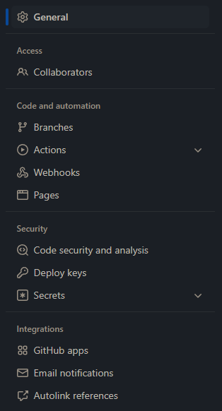
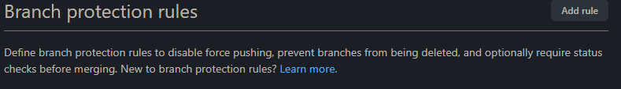
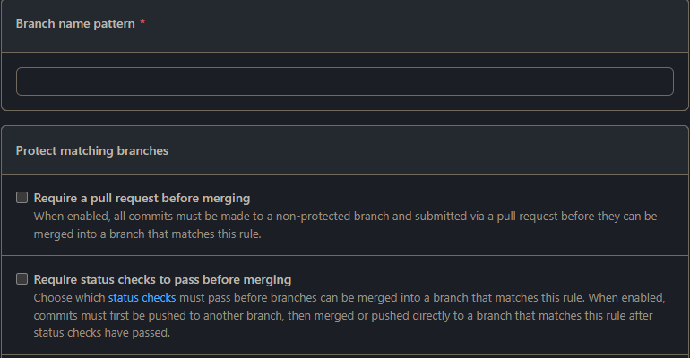

# Konteeksamen 2022 - Kandidatnummer XxXx

## Task 1

Jeg skrev en get og en post test som ikke blir brukt. Dette er på grunn av problemer med å kjøre tester i github actions uten å kjøre applikasjonen. På grunn av dette lagde jeg en dummy test som bare legger til et object i en list lokalt. Denne testen funker for oppgave 2, selv om det ikke er en ekte test. De to andre testene kan kjøres lokalt, hvis det er ønskelig.

## Task 3

Fordelen med å jobbe på denne måten er at man ikke commiter dårlig eller utrygg kode til main branchen. Det gjør det også lettere for andre å jobbe med forskjellige funksjoner samtidig. Man kan hjelpe noen som har problemer ved å hoppe inn i den individuelle branchen i repoet. Dette kan ofte føre til merge conflict i prosjektet. Når man lager en pull request kan andre se over hva du har gjort. En reviewer kan sjekke om koden er trygg og godkjenne den. Man kan bestemme hvor mange reviewer man trenger for å få merge inn i main  branchen. Før man faktisk merger får github kjørt tester og eventuelt andre jobber. Dette kan vær unit test, load test, eller å publisere et image på docker.

For å sette branch protection:
Steg 1: Gå inn i settings på et github repo du har rettigheter til.
Steg 2: Trykk på "branches" i menyen på siden:

Steg 3: Trykk på "add rule" knappen

Steg 4: Trykk på "Require a pull request before merging" og der etter "Require approvals" i undermenyen som dukker opp. Ved å ha en pipeline kjørende på feature branchen kan man automatisk bli nektet hvis f.eks. testene ikke funker. Hvis de feiler vil github stoppe deg fra å merge inn i main.

## Task 4

Sensor må navigere inn i prosjekt mappen min. Til samme mappe som dockerfile filen. Etter det trenger sensor bare å kjøre: `docker build . -t konte2022:latest`
Denne kommandoen ber docker om å builde et image i "denne" contexten med navn "konte2022" og tag "latest"

I samme mappe som forrige kommando og etter docker build kommandoen, kan sensor kjøre `docker run -p 9999:9999 konte2022:latest`. Her ber vi docker kjøre imaget fra forrige kommando på post 9999.

Sensor kan kjøre en konsoll fra hvor som helst. Imaget ligger offentlig, så sensor trenger ikke logge inn. Dette betyr at sensor bare trenger å pulle imaget fra docker ved å skrive: `docker pull hagencoderman/konte2022:latest`. Dette laster ned riktig image fra min bruker. Der etter må sensor kjøre samme kommando som fra forrige oppgave: `docker run -p 9999:9999 konte2022:latest`

Oppgaven ber om et image som allerede har blitt bygd. Da må sensor først logge inn på docker med:

`docker login`

Deretter må man tagge imaget sitt med riktig tags:

`docker tag [IMAGE_NAVN]:latest [BRUKERNAVN]/[IMAGE_NAVN]`

Dette lar oss publisere på docker hub ved å skrive:

`docker push [BRUKERNAVN]/[IMAGE_NAVN]`

## Task 5

Ene workflowen på github ble litt rotete. Blant annet er nesten alle oppgavene lagt under "build" jobben. Jeg innser at dette ikke er best practice, men jeg tenkte det var best å ikke fikse noe som allerede funker. Hvis testene ikke blir godkjent så feiler hele jobben. Dette kan lett testes ved å endre "false" til "true" på linje 59 i KonteApplicationTests.java

Som nevnt ligger det også funksjonelle tester i denne filen, men de blir ikke brukt.

Når sensor skal teste dette på sin fork må de endre en github secret. Jeg har laget en variabel for en docker access token. Denne funker som et passord. For å bruke egen docker bruker må sensor lage en egen access token som secret.
Dette blir forklart i dokumentasjonen til docker:
https://docs.docker.com/docker-hub/access-tokens/

Jeg er litt usikker på om det var dette som var ment i 5B oppgaven. Oppgaven ber om endringer i github brukeren sin. Dette er mer en endring i repoet. Jeg håper jeg har tolket B oppgaven riktig.
